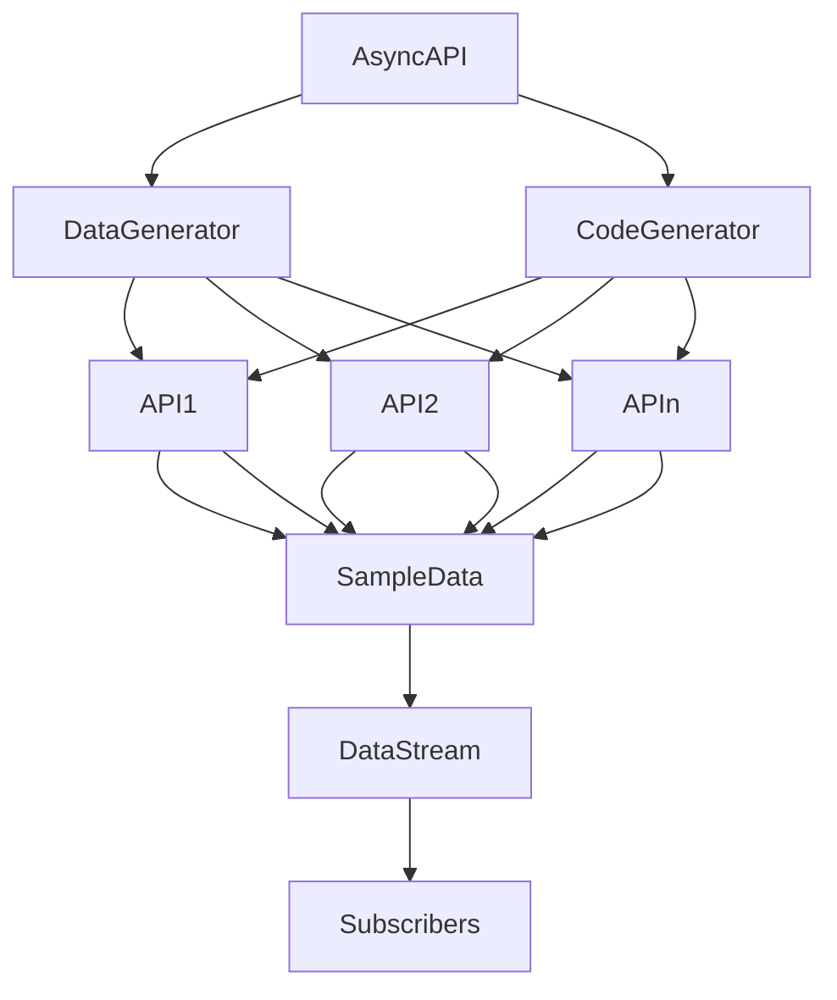

# logistics-and-distribution-event-api

This project is the manufacturing leg of a supply chain and consists of three elements;

- An AsyncAPI specification
- A Spring Cloud Stream project
- A Data Generator



## Table of Contents

- [Installation](#installation)
- [Usage](#usage)

## Installation

1. Install the Spring Cloud Stream Microservice

```bash
git clone  https://github.com/abes2345/logistics-and-distribution-event-api.git
cd  logistics-and-distribution-event-api/logisticsanddistribution
mvn clean  package
```

2. Install the Data Generator

```bash
cd  DataGenerator
npm install  fs
npm install  solclientjs
npm install  @asyncapi/parser
npm install  json-schema-faker
```

## Usage

1. Run the Spring Cloud Stream Microservice

```bash
cd  target
java -jar  LogisticsAndDistribution-0.1.0.jar
```

2. Run the Data Generator

```bash
node index.js  ../AsyncAPI/Design_and_Engineering_Event_API-0.1.0.yaml
```